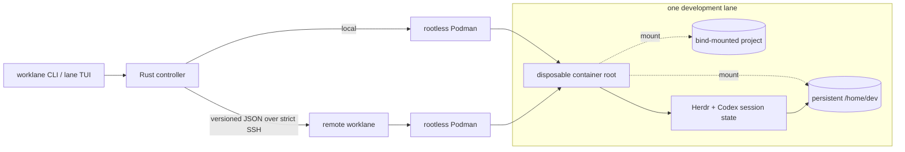

<p align="center">
  
</p>

Rust-native management for disposable, rootless Podman development lanes. The
directory selected for a lane is mounted once, as the container's `/home/dev`
and working directory. Project files, dotfiles, caches, agent state, and
user-space tools therefore remain together in the user-managed directory. The
container root filesystem is read-only and intentionally disposable.

<p align="center">
  <strong>Keep the project. Keep the agent session. Throw away the machine.</strong>
</p>

<p align="center">
  <a href="https://github.com/geraldsummers/worklane/actions/workflows/ci.yml"></a>
  
  
  <a href="LICENSE"></a>
</p>

Worklane is a Linux-first CLI and terminal dashboard for running AI coding work in disposable, rootless Podman environments. Each **lane** gets a replaceable container root while its project, `/home/dev`, and supported agent-session state live on deliberate host mounts.

It is intentionally small: one Rust controller, one keyboard-first TUI, no control plane, and no image registry. Run lanes on the local machine or operate them on a managed host over SSH.

## Why Worklane

AI-assisted development needs two seemingly opposite things: a clean machine for every task and enough continuity to resume useful work. Ordinary long-lived workstations accumulate packages, credentials, caches, and accidental state. Throwaway containers solve that problem, but they often discard the shell and agent context you actually wanted to keep.

Worklane makes that boundary explicit:

- **Disposable system state** — recreate the container root from a known image.
- **Durable work** — bind-mount the project and a lane-owned `/home/dev` from the host.
- **Resumable sessions** — attach through [Herdr](https://herdr.dev/) by default; detach without stopping its panes or agents.
- **Visible drift** — inspect writable-root changes before an upgrade or destroy operation loses them.
- **Local or remote** — use the same lifecycle against local Podman or a managed host over SSH.
- **Human and machine interfaces** — drive lanes from the TUI or consume JSON from non-interactive commands.

## A lane in 30 seconds

```sh
# From the project you want to work on:
worklane lane create api-refactor
worklane lane attach api-refactor
```

Shell completions can be generated from the installed binary:

```sh
worklane completions bash > ~/.local/share/bash-completion/completions/worklane
worklane completions zsh > ~/.zfunc/_worklane
```

On first startup, Worklane seeds its embedded standard image recipe to
`~/.local/share/worklane/Containerfile`. Custom edits are preserved, while a
recognized older stock recipe can be refreshed by a newer binary. Open it with
`worklane image edit` (the `e` key in `lane`). Standard image builds and
lane upgrades use this file. Pass `--file PATH` to override it for a single build and
`--no-cache` only when a clean Podman build is required. Worklane currently
deliberately has no OCI registry: each host builds and retains its own Podman image.

The first create builds the standard image automatically when it is missing. Future attaches open or rejoin the lane's persistent Herdr session.

```text
┌ Worklane lanes ─────────────────────────────────────────────────────┐
│ NAME               HOST           STATE      IMAGE                 │
│ api-refactor       local          running    worklane:latest       │
│ docs               buildbox       stopped    worklane:latest       │
└────────────────────────────────────────────────────────────────────┘
┌ Controls ──────────────────────────────────────────────────────────┐
│ j/k move • / filter • a Herdr • S shell • d diff • i inspect       │
│ s start • x stop • u selected upgrade • U all upgrades • r refresh │
└────────────────────────────────────────────────────────────────────┘
```

`create` defaults the project and build context to the current directory and
uses the `default` profile. If the declared image is missing, it is built automatically before
the lane starts. `lane attach` starts or reattaches the lane's default persistent Herdr session.
Detach with `Ctrl-B q`; panes and agents keep running in the lane. Use
`worklane lane attach my-project --shell` for a plain zsh login shell. Use
Herdr's own session commands only after attaching when you deliberately need a
separate Herdr server. On the first Herdr attach, Worklane installs Herdr's
Codex integration into the selected directory so supported Codex sessions can
be restored after a Herdr server restart.

### Programmatic Codex runs

The attached Codex agent is useful for interactive work, but Codex can also be reinvoked
non-interactively from scripts with `codex exec`. This is a convenient way for an agent or an
ordinary program to delegate independent, well-bounded jobs without opening another TUI. For
bulk work, write a small driver that pushes structured JSON or JSONL records into separate Codex
invocations through standard input. Select the appropriate model with `--model`, and use a JSON
Schema when the caller needs stable machine-readable results:

```sh
codex exec --ephemeral --model gpt-5.6-luna \
  -c 'model_reasoning_effort="low"' \
  --output-schema ./classification.schema.json \
  "Classify the supplied record. Return only the schema-defined result." < record.json
```

The repository includes `scripts/codex-bulk`, a standard-library Python driver that reads one
JSON object per input line, requires a stable `id` field, and appends durable result events to
an output JSONL file:

```sh
scripts/codex-bulk records.jsonl \
  --output classifications.jsonl \
  --schema classification.schema.json \
  --prompt "Classify the supplied record. Return only the schema-defined result."
```

Successful IDs are skipped when the command is rerun. Rate-limited records produce a persisted
`retrying` event before they return to the queue; final rows use `ok` or `error`. Override
`--id-field`, `--initial-workers`, or other limits when required; run
`scripts/codex-bulk --help` for the complete interface.

This pattern is especially useful for bulk classification, extraction, or tagging: split the
input into independent records, invoke bounded `codex exec` jobs with controlled concurrency,
and aggregate their structured outputs. Treat 256 parallel Codex instances as a hard upper
ceiling, not a launch target: OpenAI limits vary by organization, project, model, requests per
minute, and tokens per minute, so no fixed concurrency is universally safe. Start with four
workers and adapt from observed results. The driver should preserve a stable input ID in every
result, validate each response against the schema, and route low-confidence or terminal failures
to a fallback model. Keeping one independent record per invocation makes failures isolated and
results easy to resume or reorder; batch records together only when the classification requires
cross-record context.

Use one shared scheduler for the entire queue. After 32 consecutive successful completions,
increase its worker target by one, up to 256. If any invocation exits with `429 Too Many Requests`
or `exceeded retry limit`, stop launching new work, halve the worker target (with a floor of one),
and apply a queue-wide 60-second cooldown plus random jitter before retrying the affected record.
Do not let each subprocess immediately retry independently: unsuccessful requests also consume
rate-limit capacity, and `codex exec` has already exhausted its own retries when it reports that
message. Bound outer retries to three attempts and 15 minutes total per record, persist retry
state for resumability, and distinguish temporary rate limits from quota or billing failures that
require user action. When using the API directly instead of the CLI, honor `Retry-After` and the
`x-ratelimit-*` response headers. See OpenAI's
[rate-limit guidance](https://developers.openai.com/api/docs/guides/rate-limits).

Default to `gpt-5.6-luna` with low reasoning for these simple, high-volume delegations. It offers
enough capability for structured classification while keeping reasoning latency and token use
bounded. Reserve a stronger model or the persistent interactive agent for ambiguous cases,
synthesis, and repository-wide changes. Use `--json` instead when the caller needs the full JSONL
event stream, and keep the default read-only sandbox unless a job genuinely needs workspace writes.

Run `lane` anywhere on the controller host to open the dashboard. Detach from Herdr with `Ctrl-B q`; its panes and agents keep running in the lane. Use `worklane lane attach api-refactor --shell` when you deliberately want a plain zsh login instead.

## The persistence boundary



| State | Location | Lifecycle |
| --- | --- | --- |
| Project | Host path mounted at `/home/dev/workspace` | Never targeted by Worklane's destroy or purge operations |
| Lane home | `~/.local/share/worklane/lanes/<id>/home` | Survives recreation; archived on destroy |
| Container root | Rootless Podman storage | Recreated from the image; `diff` surfaces meaningful changes first |
| Recoverable spec | `~/.local/share/worklane/lanes/<id>/lane.toml` | Travels into the lane archive |
| Controller index | `~/.local/share/worklane/worklane.db` | Caches hosts, lane specs, and last-known state |

The local index makes the dashboard responsive even when a remote host is unavailable. The per-lane TOML keeps each lane's specification recoverable outside that index.

## Lifecycle with guardrails

| Intent | Command | Safety behavior |
| --- | --- | --- |
| Create and start | `worklane lane create NAME` | Validates the profile, builds a missing image, and snapshots the selected profile |
| Recreate a stopped lane | `worklane lane start NAME` | Recreates the disposable root from its stored spec while retaining both mounts |
| Inspect changes | `worklane lane diff NAME` | Filters mounted-home, temporary-file, and rootless-user bookkeeping noise |
| Refresh the image | `worklane lane upgrade NAME` | Rebuilds from the stored context and skips lanes with writable-root drift |
| Retire a lane | `worklane lane destroy NAME` | Refuses drift by default, removes the container, and archives lane-owned state |
| Permanently delete | `worklane lane purge ARCHIVE --yes` | Deletes only a matching archived lane home after explicit confirmation |

`--force` is available for an intentional drift override. The project path is a user-selected bind mount; lifecycle commands do not delete it.

## Install from source

### Requirements

- Linux with rootless [Podman](https://podman.io/) configured
- Rust stable and Cargo to build the two binaries
- OpenSSH client tools for remote-host support

```sh
git clone https://github.com/geraldsummers/worklane.git
cd worklane
cargo build --release --workspace

install -Dm755 target/release/worklane ~/.local/bin/worklane
install -Dm755 target/release/lane ~/.local/bin/lane
```

The standard `Containerfile` is compiled into `worklane`, so the installed binary can build its default lane image without a separate recipe file. The image currently includes Codex, Herdr, GitHub CLI, Git, zsh, Python, Node.js, TypeScript, Rust, Java 21, Kotlin, and native build tools.

Worklane v0.1 builds and retains an image on each host; it deliberately does not include an OCI push or pull workflow.

## Remote hosts

Register a host already present in your OpenSSH configuration, prepare its Worklane directories, and deploy a matching controller binary:

```sh
worklane host add buildbox --ssh dev@buildbox
worklane host bootstrap buildbox
worklane host deploy buildbox \
  --binary target/release/worklane
```

Deployment uploads a versioned binary, verifies its SHA-256 digest on the host, and atomically updates `~/.local/bin/worklane`. Controller requests use `StrictHostKeyChecking=yes`, so unknown or changed SSH host keys are rejected.

The image context and project must already exist on the remote host:

```sh
worklane image build \
  --host buildbox \
  --context /home/dev/worklane \
  --tag localhost/worklane:latest

worklane lane create api-refactor \
  --host buildbox \
  --project /home/dev/projects/api \
  --profile default
```

The portable, schema-v3 `.worklane/lane.toml` in each selected directory is
the authority for lane configuration. The controller registry at
`~/.local/share/worklane/worklane-v3.db` is only a rebuildable locator and
status cache. Recover a missing registry entry with
`worklane lane import PATH`, where `PATH` is either the selected directory or
its manifest. A lane's display name can change (`lane rename`, or `n` in the
TUI), while its UUID, Podman container name, and creation-time Herdr
session/workspace name remain stable.

This is an explicit clean break. If Worklane finds `worklane.db` or
`worklane-v2.db` without a v3 registry, it stops and leaves the old database
untouched. Acknowledge a clean registry with
`worklane registry init --fresh`, then import only manifests you have verified.
Older or unknown manifest schemas are rejected and never rewritten.

`lane delete NAME` (the `D` key) always contacts the owning host, checks drift,
removes the disposable container, removes the registry record, and deletes only
the exact `.worklane/lane.toml` control file. It never deletes the selected
directory or its contents. `lane forget NAME` (the `F` key) removes only the
controller registry entry and deliberately leaves the manifest and Podman
state intact. There are no ambiguous archive, destroy, or purge commands.

Lifecycle changes use a per-lane operation journal and commit the portable
manifest and registry projection only after runtime preparation succeeds.
Retries are safe. `worklane lane reconcile NAME` reports manifest, cache,
runtime, and interrupted-operation differences without changing them;
`--apply` performs only verified repairs and reports every change or unresolved
condition. The TUI exposes the same commands with `c` (report) and a confirmed
`C` (apply).

## Hosts and deployment

```sh
worklane host add lab --ssh dev@192.168.0.11
worklane host bootstrap lab
worklane host deploy lab --binary target/x86_64-unknown-linux-gnu/release/worklane
```

The SSH transport uses the existing OpenSSH configuration with `StrictHostKeyChecking=yes`; unknown or changed keys are rejected. Deployment copies a versioned binary, verifies SHA-256 on the host, then atomically updates `~/.local/bin/worklane`.

All control commands accept `--json`. `image build` and `image inspect` accept
`--host`; `image push` is intentionally unavailable. Builds use Podman's cache
by default and accept `--no-cache` explicitly. `lane upgrade --all` builds each
distinct effective image once per host, then recreates its lanes so their
immutable root filesystems are fresh. In the TUI, `u` performs a cached upgrade
of one lane, while `U` performs a fresh `--no-cache` upgrade of all effective
images and pulls the standard image's base. Custom Containerfiles retain
control over local-only base images. Run `lane` for the keyboard-first terminal
view. Host operations and bounded state checks run in the background; cached
state is rendered immediately with its age, navigation remains available, and
an unreachable host does not hide other lanes. Errors stay attached to the
affected lane until dismissed with `Esc` or cleared by a successful retry.

Worklane does not impose a per-lane disk quota or preallocate storage. Because
all persistent state is in the selected directory, users can inspect, back up,
move, and constrain it with their filesystem's normal tools.

## Profiles

Profiles are named entries in `~/.config/worklane/profiles.toml`. The built-in
`default` profile uses the embedded Containerfile, outbound networking, and no
extra mounts. A profile is snapshotted when a lane is created.
An omitted `build_context` follows the lane's selected directory when it is
moved or imported; an explicit path remains fixed.
Profiles define an image, network policy, build context, and any additional mounts; Worklane snapshots the selected profile into the lane spec at creation time.

```toml
[profiles.offline-docs]
image = "localhost/worklane:latest"
network = "none"
build_context = "/home/dev/worklane"

[[profiles.docs.mounts]]
source = "/home/gerald/.cache/pip"
target = "/home/dev/.cache/pip"
read_only = false
```

Create with `worklane lane create docs --profile docs`. Mount sources and
targets must be absolute. Targets may live below `/home/dev`, but they may not
replace `/home/dev`, contain it, or overlap another custom target.

[[profiles.offline-docs.mounts]]
source = "/home/dev/reference"
target = "/mnt/reference"
read_only = true
```

```sh
worklane lane create docs --profile offline-docs
```

Mount sources and targets must be absolute. Worklane rejects extra mounts that overlap its managed home or project workspace.

## Automation surface

Pass `--json` before any non-interactive command to receive the same structured state used by the dashboard:

```sh
worklane --json lane list | jq '.[] | {
  name: .spec.name,
  host: .spec.host,
  state,
  drift
}'
```

The remote controller uses a versioned JSON executor protocol, so protocol-incompatible controller binaries fail closed instead of interpreting an incompatible request.

## Repository map

```text
worklane/
├── worklane/       # lifecycle CLI, Podman orchestration, remote transport
├── lane/           # Ratatui dashboard
├── worklane-core/  # specs, profiles, SQLite registry, drift classification
├── Containerfile   # embedded standard development image
└── .github/        # formatting, lint, test, and coverage gates
```

The CI contract is intentionally strict:

```sh
cargo fmt --check
cargo clippy --workspace --all-targets -- -D warnings
cargo test --workspace
cargo llvm-cov --workspace --fail-under-lines 90
```

## Trust boundary

Worklane is a development-workflow boundary, **not a sandbox for hostile code**. The standard lane has outbound networking, gives its `dev` user passwordless sudo inside the rootless container, and exposes the selected project plus any profile mounts. Code running in a lane should be trusted relative to those resources.

Rootless Podman limits host privilege, while Worklane's drift checks and archive-first lifecycle protect against accidental state loss. They are operational guardrails, not a security certification.

## Project status

Worklane is a personal engineering project in active v0.1 development. The core local and remote lifecycle, persistent Herdr attach flow, dashboard, drift protection, profile model, JSON interface, and CI quality gates are implemented. Prebuilt releases and backward-compatibility guarantees are not yet provided.

Licensed under [AGPL-3.0-or-later](LICENSE-NOTICE.md).
