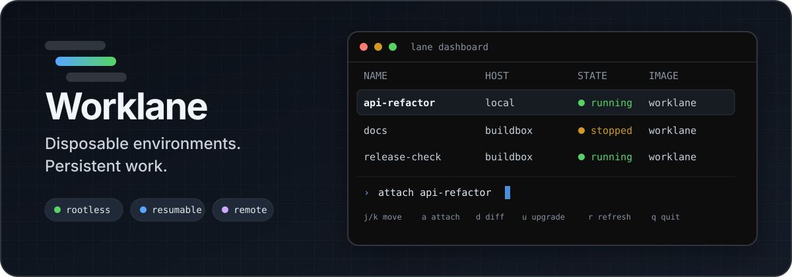
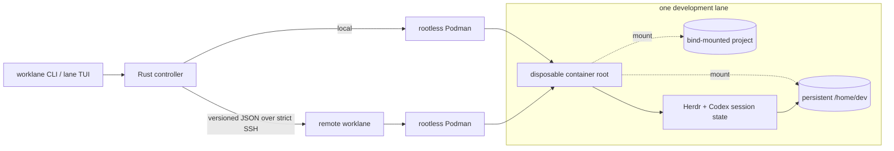

<p align="center">
  
</p>

<p align="center">
  <strong>Keep the project. Keep the agent session. Throw away the machine.</strong>
</p>

<p align="center">
  <a href="https://github.com/geraldsummers/worklane/actions/workflows/ci.yml"></a>
  
  
  <a href="LICENSE"></a>
</p>

Worklane is a Linux-first CLI and terminal dashboard for running AI coding work in disposable, rootless Podman environments. Each **lane** gets a replaceable container root while its project, `/home/dev`, and supported agent-session state live on deliberate host mounts.

It is intentionally small: one Rust controller, one keyboard-first TUI, no control plane, and no image registry. Run lanes on the local machine or operate them on a managed host over SSH.

## Why Worklane

AI-assisted development needs two seemingly opposite things: a clean machine for every task and enough continuity to resume useful work. Ordinary long-lived workstations accumulate packages, credentials, caches, and accidental state. Throwaway containers solve that problem, but they often discard the shell and agent context you actually wanted to keep.

Worklane makes that boundary explicit:

- **Disposable system state** — recreate the container root from a known image.
- **Durable work** — bind-mount the project and a lane-owned `/home/dev` from the host.
- **Resumable sessions** — attach through [Herdr](https://herdr.dev/) by default; detach without stopping its panes or agents.
- **Visible drift** — inspect writable-root changes before an upgrade or destroy operation loses them.
- **Local or remote** — use the same lifecycle against local Podman or a managed host over SSH.
- **Human and machine interfaces** — drive lanes from the TUI or consume JSON from non-interactive commands.

## A lane in 30 seconds

```sh
# From the project you want to work on:
worklane lane create api-refactor
worklane lane attach api-refactor
```

The first create builds the standard image automatically when it is missing. Future attaches open or rejoin the lane's persistent Herdr session.

```text
┌ Worklane lanes ─────────────────────────────────────────────────────┐
│ NAME               HOST           STATE      IMAGE                 │
│ api-refactor       local          running    worklane:latest       │
│ docs               buildbox       stopped    worklane:latest       │
└────────────────────────────────────────────────────────────────────┘
┌ Controls ──────────────────────────────────────────────────────────┐
│ j/k move • / filter • a Herdr • S shell • d diff • i inspect       │
│ s start • x stop • u selected upgrade • U all upgrades • r refresh │
└────────────────────────────────────────────────────────────────────┘
```

Run `lane` anywhere on the controller host to open the dashboard. Detach from Herdr with `Ctrl-B q`; its panes and agents keep running in the lane. Use `worklane lane attach api-refactor --shell` when you deliberately want a plain zsh login instead.

## The persistence boundary



| State | Location | Lifecycle |
| --- | --- | --- |
| Project | Host path mounted at `/home/dev/workspace` | Never targeted by Worklane's destroy or purge operations |
| Lane home | `~/.local/share/worklane/lanes/<id>/home` | Survives recreation; archived on destroy |
| Container root | Rootless Podman storage | Recreated from the image; `diff` surfaces meaningful changes first |
| Recoverable spec | `~/.local/share/worklane/lanes/<id>/lane.toml` | Travels into the lane archive |
| Controller index | `~/.local/share/worklane/worklane.db` | Caches hosts, lane specs, and last-known state |

The local index makes the dashboard responsive even when a remote host is unavailable. The per-lane TOML keeps each lane's specification recoverable outside that index.

## Lifecycle with guardrails

| Intent | Command | Safety behavior |
| --- | --- | --- |
| Create and start | `worklane lane create NAME` | Validates the profile, builds a missing image, and snapshots the selected profile |
| Recreate a stopped lane | `worklane lane start NAME` | Recreates the disposable root from its stored spec while retaining both mounts |
| Inspect changes | `worklane lane diff NAME` | Filters mounted-home, temporary-file, and rootless-user bookkeeping noise |
| Refresh the image | `worklane lane upgrade NAME` | Rebuilds from the stored context and skips lanes with writable-root drift |
| Retire a lane | `worklane lane destroy NAME` | Refuses drift by default, removes the container, and archives lane-owned state |
| Permanently delete | `worklane lane purge ARCHIVE --yes` | Deletes only a matching archived lane home after explicit confirmation |

`--force` is available for an intentional drift override. The project path is a user-selected bind mount; lifecycle commands do not delete it.

## Install from source

### Requirements

- Linux with rootless [Podman](https://podman.io/) configured
- Rust stable and Cargo to build the two binaries
- OpenSSH client tools for remote-host support

```sh
git clone https://github.com/geraldsummers/worklane.git
cd worklane
cargo build --release --workspace

install -Dm755 target/release/worklane ~/.local/bin/worklane
install -Dm755 target/release/lane ~/.local/bin/lane
```

The standard `Containerfile` is compiled into `worklane`, so the installed binary can build its default lane image without a separate recipe file. The image currently includes Codex, Herdr, GitHub CLI, Git, zsh, Python, Node.js, TypeScript, Rust, Java 21, Kotlin, and native build tools.

Worklane v0.1 builds and retains an image on each host; it deliberately does not include an OCI push or pull workflow.

## Remote hosts

Register a host already present in your OpenSSH configuration, prepare its Worklane directories, and deploy a matching controller binary:

```sh
worklane host add buildbox --ssh dev@buildbox
worklane host bootstrap buildbox
worklane host deploy buildbox \
  --binary target/release/worklane
```

Deployment uploads a versioned binary, verifies its SHA-256 digest on the host, and atomically updates `~/.local/bin/worklane`. Controller requests use `StrictHostKeyChecking=yes`, so unknown or changed SSH host keys are rejected.

The image context and project must already exist on the remote host:

```sh
worklane image build \
  --host buildbox \
  --context /home/dev/worklane \
  --tag localhost/worklane:latest

worklane lane create api-refactor \
  --host buildbox \
  --project /home/dev/projects/api \
  --profile default
```

## Profiles

Profiles live in `~/.config/worklane/profiles.toml` and define an image, network policy, build context, and any additional mounts. Worklane snapshots the selected profile into the lane spec at creation time.

```toml
[profiles.offline-docs]
image = "localhost/worklane:latest"
network = "none"
build_context = "/home/dev/worklane"

[[profiles.offline-docs.mounts]]
source = "/home/dev/reference"
target = "/mnt/reference"
read_only = true
```

```sh
worklane lane create docs --profile offline-docs
```

Mount sources and targets must be absolute. Worklane rejects extra mounts that overlap its managed home or project workspace.

## Automation surface

Pass `--json` before any non-interactive command to receive the same structured state used by the dashboard:

```sh
worklane --json lane list | jq '.[] | {
  name: .spec.name,
  host: .spec.host,
  state,
  drift
}'
```

The remote controller uses a versioned JSON executor protocol, so protocol-incompatible controller binaries fail closed instead of interpreting an incompatible request.

## Repository map

```text
worklane/
├── worklane/       # lifecycle CLI, Podman orchestration, remote transport
├── lane/           # Ratatui dashboard
├── worklane-core/  # specs, profiles, SQLite registry, drift classification
├── Containerfile   # embedded standard development image
└── .github/        # formatting, lint, test, and coverage gates
```

The CI contract is intentionally strict:

```sh
cargo fmt --check
cargo clippy --workspace --all-targets -- -D warnings
cargo test --workspace
cargo llvm-cov --workspace --fail-under-lines 90
```

## Trust boundary

Worklane is a development-workflow boundary, **not a sandbox for hostile code**. The standard lane has outbound networking, gives its `dev` user passwordless sudo inside the rootless container, and exposes the selected project plus any profile mounts. Code running in a lane should be trusted relative to those resources.

Rootless Podman limits host privilege, while Worklane's drift checks and archive-first lifecycle protect against accidental state loss. They are operational guardrails, not a security certification.

## Project status

Worklane is a personal engineering project in active v0.1 development. The core local and remote lifecycle, persistent Herdr attach flow, dashboard, drift protection, profile model, JSON interface, and CI quality gates are implemented. Prebuilt releases and backward-compatibility guarantees are not yet provided.

Licensed under [AGPL-3.0-or-later](LICENSE-NOTICE.md).
